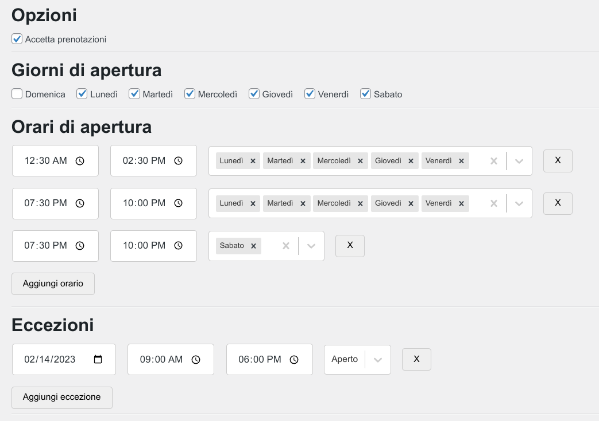

# Shop Status WordPress Plugin
🏪 A WordPress Plugin that easily manages Shops' opening times - Built with React and Webpack

## Instructions
- Install dependencies with `yarn`
- Build the plugin with `yarn build`
- Copy the `dist` folder and the `index.php` file into a folder in your `wp-content/plugins`
- Activate the plugin and enjoy 🎉
